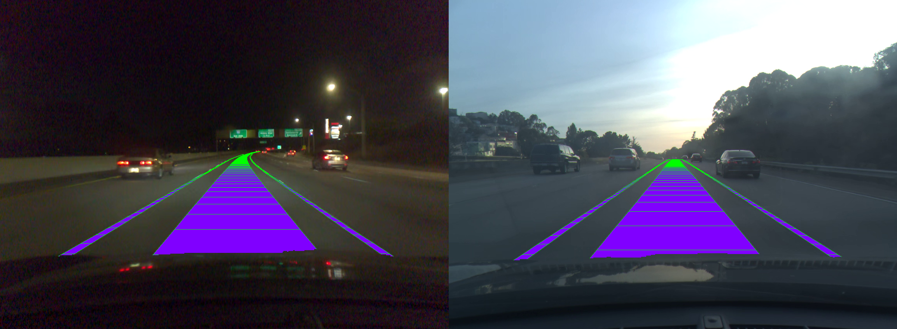
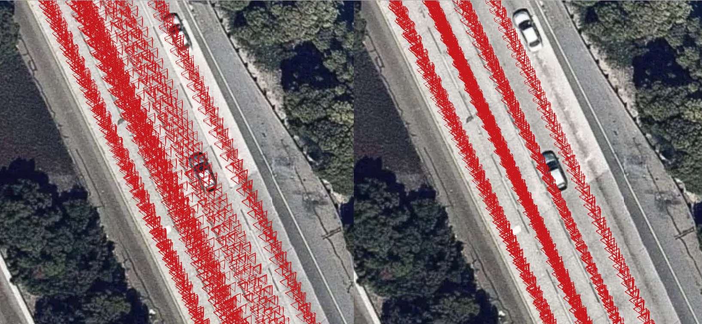

# comma2k19
[comma.ai](https://comma.ai) presents comma2k19, a dataset of over 33 hours of commute in California's 280 highway. This means 2019 segments, 1 minute long each, on a 20km section of highway driving between California's San Jose and San Francisco. comma2k19 is a fully reproducible and scalable dataset. The data was collected using comma [EONs](https://comma.ai/shop/products/eon-gold-dashcam-devkit/) that has sensors similar to those of any modern smartphone including a road-facing camera, phone GPS, thermometers and 9-axis IMU. Additionally, the EON captures raw GNSS measurements and all CAN data sent by the car with a comma [grey panda](https://comma.ai/shop/products/panda-obd-ii-dongle/). 



Here we also introduced [Laika](https://github.com/commaai/laika), an open-source GNSS processing library. Laika produces 40% more accurate positions than the GNSS module used to collect the raw data. This dataset includes pose (position + orientation) estimates in a global reference frame of the recording camera. These poses were computed with a tightly coupled INS/GNSS/Vision optimizer that relies on data processed by Laika. comma2k19 is ideal for development and validation of tightly coupled GNSS algorithms and mapping algorithms that work with commodity sensors. 




## Publication
For a detailed write-up about this dataset, please refer to our [paper](https://arxiv.org/abs/1812.05752v1). If you use comma2k19 or Laika in your research, please consider citing
```text
@misc{1812.05752,
Author = {Harald Schafer and Eder Santana and Andrew Haden and Riccardo Biasini},
Title = {A Commute in Data: The comma2k19 Dataset},
Year = {2018},
Eprint = {arXiv:1812.05752},
}
```

## Downloads
The total dataset is ~100GB and can be downloaded [here](http://academictorrents.com/details/65a2fbc964078aff62076ff4e103f18b951c5ddb) It is divided into ~10GB chunks.

## Example Code
There is an example data segment in this repo for experimentation. There are also some notebooks with some example code. Including a position benchmark. This code has only been tested on python 2.x and ubuntu 16.04. Make sure to `pip install -r requirements_examples.txt` if you do not have the relevant packages installed already.
The examples contain a 1 minute sample segment and some sample notebooks.
* processed_readers: some examples of data reading and plotting
* position_benchmarks: example of running the position benchmark used to evaluate fix quality
* raw_readers: example of using [openpilot_tools](https://github.com/commaai/openpilot-tools)

For examples related to raw GNSS please check out [Laika](https://github.com/commaai/laika)

## Dataset Structure

#### Directory Structure
The data is split into 10 chunks of each about 200 minutes of driving. Chunks 1-2 of the dataset are of the RAV4 and the rest is the civic. The dongle_id of the RAV4 is `b0c9d2329ad1606b` and that of the civic is `99c94dc769b5d96e`.
```
Dataset_chunk_n
|
+-- route_id (dongle_id|start_time)
    |
    +-- segment_number
        |
        +-- preview.png (first frame video)
        +-- raw_log.bz2 (raw capnp log, can be read with openpilot-tools: logreader)
        +-- video.hevc (video file, can be read with openpilot-tools: framereader)
        +-- processed_log/ (processed logs as numpy arrays, see format for details)
        +-- global_pos/ (global poses of camera as numpy arrays, see format for details)
```

#### Log Format
Every log type in processed_log director contains 2 numpy arrays. A timestamp array in seconds using the system device's boot time and a value array.
```
processed_log
|
+--IMU ([forward, right, down])
|  |
|  +--acceleration: (m^2/s)
|  +--gyro_uncalibrated (rad/s)
|  +--gyro_bias: android gyro bias estimate (rad/s)
|  +--gyro: with android bias correction (rad/s)
|  +--magnetic_uncalibrated: (T)
|  +--magnetic: with android calibration(T)
|
+--CAN data:
|  |
|  +--car_speed (m/s)
|  +--steering_angle (deg)
|  +--wheel_speeds: [front_left, front_right, rear_left, rear_right] (m/s)
|  +--radar: [forward distance (m),
|  |          left distance (m),
|  |          nan,
|  |          nan,
|  |          address,
|  |          new_track (bool)]
|  +--raw CAN: This not stored as a value array but as three seperate arrays [src, address, data]
|
+--GNSS
   |
   +--live_gnss_qcom: [latitude (deg),
   |                   longitude (deg),
   |                   speed (m/s),
   |                   utc_timestamp (s),
   |                   altitude (m),
   |                   bearing (deg)]
   +--live_gnss_ublox: [latitude (deg),
   |                    longitude (deg),
   |                    speed (m/s),
   |                    utc_timestamp (s),
   |                    altitude (m),
   |                    bearing (deg)]
   |
   +--raw_gnss_qcom: every row represents a measurement
   |                 of 1 sattelite at 1 epoch can easily
   |                 be manipulated with laika.
   |                 [prn (nmea_id, see laika),
   |                  week of gps_time of reception (gps_week),
   |                  time pf week of gps_time of reception (s),
   |                  nan,
   |                  pseudorange (m),
   |                  pseudorange_std (m),
   |                  pseudorange_rate (m/s),
   |                  pseudorange_rate_std (m/s)]
   +--raw_gnss_ublox: every row represents a measurement
                      of 1 sattelite at 1 epoch can easily
                      be manipulated with laika.
                      [prn (nmea_id, see laika),
                       week of gps_time of reception (gps_week),
                       time pf week of gps_time of reception (s),
                       GLONASS channel number (-7..6) nan if not GLONASS,
                       pseudorange (m),
                       pseudorange_std (m),
                       pseudorange_rate (m/s),
                       pseudorange_rate_std (m/s)]
```


#### Pose Format
```
The poses of the camera and timestamps of every frame of the video are stored
as follows:
  frame_times: timestamps of video frames in boot time (s)
  frame_gps_times: timestamps of video frames in gps_time: ([gps week (weeks), time-of-week (s)])
  frame_positions: global positions in ECEF of camera(m)
  frame_velocities: global velocity in ECEF of camera (m/s)
  frame_orientations: global orientations as quaternion needed to
                      rotate from ECEF  frame to local camera frame
                      defined as [forward, right, down] (hamilton quaternion!!!!)
```
## Contact
For questions, concerns or suggestions please contact harald@comma.ai
